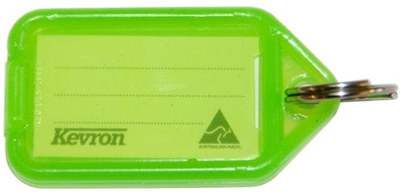
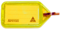
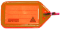
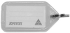

### What is OSINTive? 
OSINTive is a fun community based game encouraging you to learn OSINT.  OSINT means Open Source Intelligence, and the word OSINTive is a play on words from "Incentive"... meaning there is an incentive to play OSINT.

### What exactly is OSINT?
OSINT, or Open Source Intelligence, in Cyber Security is any sort of intelligence gained through any publicly avaialble source. It is used for good, and for malicious intent, and in this case used for fun. 

### Great! How do I get involved?
It's simple, check out these simple steps! 
- Social media account, preferably twitter;
- Find the flag using hashtags;
    - [#OSINT](https://twitter.com/search?q=%23OSINT&src=typeahead_click) (Open Source Intelligence)
    - [#CTF](https://twitter.com/search?q=%23CTF&src=typeahead_click) (Capture the Flag)
    - [#CBR](https://twitter.com/search?q=%23CBR&src=typeahead_click) (Your your locality, #SYD, #BNE, etc.)
    - [#TSS](https://twitter.com/search?q=%23TSS&src=typed_query&f=live) (Optional, your company name)
- Track the flag down using the knowledge you've gained;
- Find the flag, claim it as your own, brag about it;
- Find a new location, and post a selfie of yourself with it.

Here is an example of a [twitter](https://twitter.com/search?q=%23OSINT%20%23CBR%20%23CTF&src=typed_query&f=live) and [linkedin](https://www.linkedin.com/search/results/content/?keywords=%23osint%20%23cbr%20%23ctf&origin=SWITCH_SEARCH_VERTICAL) search for currently active flags.

### What do the different colours mean?
We want everyone to join in, so we've decided on different difficulties to challenge different learning paths.

- #### Green 
    - Green Flags are easy. These are for everyone to get involved and have some fun.  These will require;
        - a photo of the flags location;
        - an optional selfie;
        - hashtags, and;
        - a recognisable location, e.g. tourist spots, resturants, etc.

- #### Yellow 
    - Yellow Flags are moderately hard. These are for someone who is more experienced with OSINT and looking to increase the challenge.  These will require;
        - a non-tourist spot, and;
        - Other points TBA

- #### Red 
    - Red Flags are hard.  These are intended for experienced OSINTers' where an image isn't the whole and only story.  These flags will require some creativity and hard work, both for the person who hides them and searches for them.  The requirements are TBA.

- #### White 
    - White flags are intended for permanent locations.  These flags are TBA, they will require some development for community tracking.

### Are there rules?
First and foremost, safety is everyone's responsibility. We do not encourage any illegal behaviour, and do not encourage any unsafe activities. More TBA.

